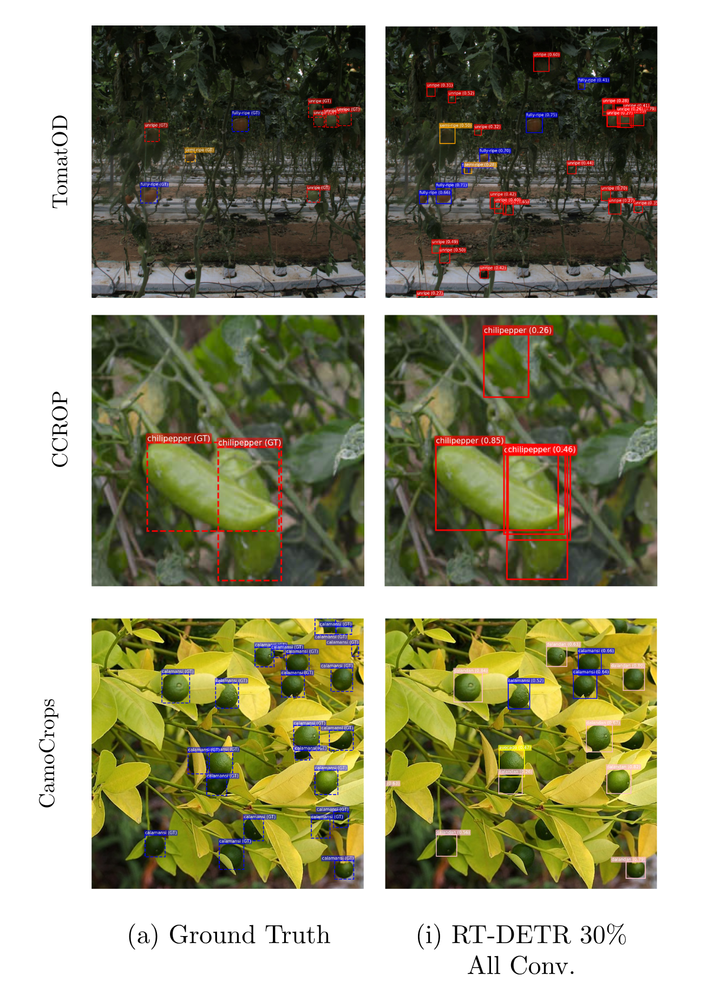

# CamoFarmer: A Lightweight Computer Vision Model for Camouflaged Crop Detection

## 📌 Proponents & Adviser
- **Charles Joseph Hinolan** – [charles_hinolan@dlsu.edu.ph](mailto:charles_hinolan@dlsu.edu.ph)  
- **Mac Andre Javellana** – [mac_javellana@dlsu.edu.ph](mailto:mac_javellana@dlsu.edu.ph)  
- **Mari Salvador Lapuz** – [mari_lapuz@dlsu.edu.ph](mailto:mari_lapuz@dlsu.edu.ph)  
- **Audrea Arjaemi Tabadero** – [audrea_tabadero@dlsu.edu.ph](mailto:audrea_tabadero@dlsu.edu.ph)  
- **Arren Matthew Antioquia** – [arren.antioquia@dlsu.edu.ph](mailto:arren.antioquia@dlsu.edu.ph)  

---

## 📖 Overview
Camouflaged object detection (COD) has emerged as a key innovation in agriculture, addressing the challenge of identifying crops that blend into their natural environments.  
This study introduces **CamoFarmer**, a lightweight detection model optimized for camouflaged crop detection in resource-constrained settings.

We adapted three general object detection models — **SSD**, **YOLOv8**, and **RT-DETR** — using:
- **Lightweight backbone replacement**
- **Network pruning**
- **Knowledge distillation**

These techniques aimed to reduce model complexity while maintaining strong detection performance.

---

## 📊 Key Results
Experiments were conducted on **TomatOD**, **CCROP**, and **CamoCrops** datasets.  
After extensive evaluation, **RT-DETR** was chosen as the base model for **CamoFarmer**.

The final optimized model:
- **Pruned by 30% across all layers**
- **Parameter reduction:** 22.81% (from 32.8M → 25.35M)
- **FLOPs:** Unchanged at 29.57G
- **Performance:**  
  - Up to **+5% mAP** improvement on some datasets  
  - Minimal accuracy decreases on others

 ### 📈 Complete Experiment Results

| Model & Strategy | TomatOD mAP50 | Params (M) | FLOPs (G) | CCROP mAP50 | Params (M) | FLOPs (G) | CamoCrops mAP50 | Params (M) | FLOPs (G) |
| --- | --- | --- | --- | --- | --- | --- | --- | --- | --- |
| SSD -- Baseline | 67.70 | 24.01 | 61.11 | 87.09 | 23.88 | 60.96 | 56.77 | 25.62 | 62.30 |
| YOLOv8n -- Baseline | 71.92 | 3.01 | 8.10 | 94.78 | 3.01 | 8.10 | 52.21 | 3.01 | 8.10 |
| YOLOv8l -- Baseline | 82.37 | 43.61 | 164.80 | 94.49 | 43.61 | 164.80 | 57.55 | 43.61 | 164.80 |
| RT-DETR -- Baseline | 57.59 | 32.81 | 29.58 | 94.87 | 32.81 | 29.57 | 55.99 | 32.84 | 29.59 |
| SSD  -- Shufflenet V2 | 25.10 | 1.98 | 1.07 | 73.31 | 1.89 | 1.00 | 46.15 | 3.08 | 1.85 |
| SSD  -- MobileNet V2 | 24.80 | 2.82 | 1.31 | 72.17 | 2.75 | 1.29 | 49.21 | 3.72 | 1.59 |
| SSD  -- EfficientNet | 20.80 | 3.88 | 1.54 | 71.45 | 3.84 | 1.51 | 45.49 | 4.30 | 1.76 |
| YOLOv8n  -- Shufflenet V2 | 70.82 | 3.30 | 8.00 | 92.94 | 3.30 | 8.00 | 46.68 | 3.31 | 8.00 |
| YOLOv8n  -- MobileNet V2 | 74.81 | 4.35 | 10.90 | 93.70 | 4.35 | 10.80 | 45.94 | 4.35 | 10.90 |
| YOLOv8n  -- EfficientNet | 76.69 | 6.53 | 12.90 | 94.70 | 6.53 | 13.00 | 43.11 | 6.54 | 13.00 |
| YOLOv8l  -- Shufflenet V2 | 75.27 | 25.41 | 81.80 | 93.09 | 25.41 | 81.80 | 49.16 | 25.43 | 82.10 |
| YOLOv8l  -- MobileNet V2 | 77.05 | 26.55 | 84.70 | 93.69 | 26.55 | 84.70 | 52.08 | 26.57 | 84.90 |
| YOLOv8l  -- EfficientNet | 79.17 | 29.39 | 87.50 | 94.53 | 29.39 | 87.50 | 47.19 | 29.41 | 87.80 |
| RT-DETR  -- Shufflenet V2 | 19.19 | 21.29 | 19.44 | 89.08 | 21.29 | 19.44 | 46.90 | 21.31 | 19.45 |
| RT-DETR  -- MobileNet V2 | 19.80 | 21.49 | 19.76 | 90.63 | 21.49 | 19.76 | 44.86 | 21.51 | 19.78 |
| RT-DETR  -- EfficientNet | 24.76 | 26.03 | 20.71 | 91.08 | 26.03 | 20.71 | 46.27 | 26.05 | 20.73 |
| SSD -- Pruning (All) -- 0.03 | 69.40 | 23.29 | 61.10 | 86.52 | 24.85 | 60.96 | 55.40 | 23.16 | 62.30 |
| SSD -- Pruning (All) -- 0.05 | 68.40 | 22.81 | 61.10 | 86.85 | 24.34 | 60.96 | 54.95 | 22.69 | 62.30 |
| SSD -- Pruning (All) -- 0.1 | 69.00 | 21.61 | 61.10 | 86.83 | 23.06 | 60.96 | 55.35 | 21.49 | 62.30 |
| SSD -- Pruning (All) -- 0.3 | 68.90 | 16.81 | 61.10 | 86.41 | 17.93 | 60.96 | 54.38 | 16.72 | 62.30 |
| SSD -- Pruning (All) -- 0.5 | 69.90 | 12.01 | 61.10 | 86.19 | 12.81 | 60.96 | 54.76 | 11.94 | 62.30 |
| YOLOv8n -- Pruning (All) -- 0.03 | 75.16 | 2.92 | 8.10 | 94.53 | 2.92 | 8.10 | 46.79 | 2.92 | 8.10 |
| YOLOv8n -- Pruning (All) -- 0.05 | 74.11 | 2.86 | 8.10 | 94.64 | 2.86 | 8.10 | 46.73 | 2.86 | 8.10 |
| YOLOv8n -- Pruning (All) -- 0.1 | 10.79 | 2.71 | 8.10 | 60.83 | 2.71 | 8.10 | 36.35 | 2.71 | 8.10 |
| YOLOv8n -- Pruning (All) -- 0.3 | 0.15 | 2.11 | 8.10 | 0.00 | 2.11 | 8.10 | 1.58 | 2.11 | 8.10 |
| YOLOv8n -- Pruning (All) -- 0.5 | 0.07 | 1.51 | 8.10 | 0.01 | 1.51 | 8.10 | 0.01 | 1.51 | 8.10 |
| YOLOv8l -- Pruning (All) -- 0.03 | 82.38 | 42.32 | 164.80 | 94.79 | 42.32 | 164.80 | 47.67 | 42.33 | 164.80 |
| YOLOv8l -- Pruning (All) -- 0.05 | 82.45 | 41.45 | 164.80 | 94.58 | 41.45 | 164.80 | 48.88 | 41.46 | 164.80 |
| YOLOv8l -- Pruning (All) -- 0.1 | 13.96 | 39.27 | 164.80 | 76.68 | 39.27 | 164.80 | 40.52 | 39.28 | 164.80 |
| YOLOv8l -- Pruning (All) -- 0.3 | 0.03 | 30.55 | 164.80 | 0.44 | 30.55 | 164.80 | 2.68 | 30.56 | 164.80 |
| YOLOv8l -- Pruning (All) -- 0.5 | 0.16 | 21.83 | 164.80 | 0.01 | 21.83 | 164.80 | 0.03 | 21.84 | 164.80 |
| RT-DETR -- Pruning (All) -- 0.03 | 64.63 | 32.06 | 29.58 | 94.94 | 32.06 | 29.57 | 52.44 | 32.09 | 29.59 |
| RT-DETR -- Pruning (All) -- 0.05 | 61.13 | 31.56 | 29.58 | 94.92 | 31.56 | 29.57 | 52.97 | 31.59 | 29.59 |
| RT-DETR -- Pruning (All) -- 0.1 | 64.89 | 30.32 | 29.58 | 94.88 | 30.32 | 29.57 | 53.17 | 30.35 | 29.59 |
| RT-DETR -- Pruning (All) -- 0.3 | 60.96 | 25.35 | 29.58 | 95.02 | 25.35 | 29.57 | 53.84 | 25.38 | 29.59 |
| RT-DETR -- Pruning (All) -- 0.5 | 58.40 | 20.38 | 29.58 | 95.18 | 20.38 | 29.57 | 52.72 | 20.41 | 29.59 |
| SSD  -- SSD-EfficientNet | 25.80 | 3.88 | 1.54 | 73.40 | 3.84 | 1.52 | 44.27 | 4.30 | 1.76 |
| SSD  -- SSD-MobileNet V2 | 23.50 | 2.82 | 1.31 | 73.77 | 2.75 | 1.29 | 48.19 | 3.72 | 1.59 |
| SSD  -- SSD-ShuffleNet V2 | 20.40 | 1.98 | 1.07 | 70.01 | 1.89 | 1.00 | 44.60 | 3.08 | 1.85 |
| YOLOv8n  -- YOLOv8l - YOLOv8n(ShuffleNet V2) | 72.87 | 3.30 | 8.00 | 92.01 | 3.30 | 8.00 | 44.76 | 3.31 | 8.00 |
| YOLOv8n  -- YOLOv8l-YOLOv8n(EfficientNet) | 79.24 | 6.53 | 12.90 | 94.82 | 6.53 | 13.00 | 42.34 | 6.54 | 13.00 |
| YOLOv8n  -- YOLOv8l-YOLOv8n(MobileNet V2) | 75.65 | 4.35 | 10.90 | 93.52 | 4.35 | 10.80 | 43.96 | 4.35 | 10.90 |
| YOLOv8l  -- YOLOv8l - YOLOv8l (ShuffleNet V2) | 74.78 | 25.41 | 81.80 | 92.83 | 25.41 | 81.80 | 43.15 | 25.43 | 82.10 |
| YOLOv8l  -- YOLOv8l-YOLOv8l(EfficientNet) | 78.34 | 29.39 | 87.50 | 94.16 | 29.39 | 87.50 | 40.73 | 29.41 | 87.80 |
| YOLOv8l  -- YOLOv8l-YOLOv8l(MobileNet V2) | 76.10 | 26.55 | 84.70 | 93.55 | 26.55 | 84.70 | 44.84 | 26.57 | 84.90 |
| RT-DETR  -- RTDETR-EfficientNet | 27.32 | 26.03 | 20.71 | 97.98 | 26.03 | 20.71 | 43.40 | 26.05 | 20.73 |
| RT-DETR  -- RTDETR-MobileNet V2 | 20.71 | 21.49 | 19.76 | 97.47 | 21.49 | 19.76 | 45.32 | 21.51 | 19.78 |
| RT-DETR  -- RTDETR-ShuffleNet V2 | 22.92 | 21.29 | 19.44 | 96.74 | 21.29 | 19.44 | 44.50 | 21.31 | 19.45 |

---

## 📷 Qualitative Results

**Figure:**  shows qualitative differences after pruning on RT-DETR-l with 30\% all-convolutional layer pruning. On TomatOD, duplicate detections and occasional misclassifications increase in dense foliage. On CCROP, we observe extra boxes and tighter clusters around single objects, indicating reduced localization precision. On CamoCrops, the main failure mode is missed small or partially occluded crops. Overall, pruning trades computation for accuracy. The effect is strongest where camouflage and occlusion are severe, and the dataset is more complex.

---
## 📂 Trained Weights
Trained model weights are available here:  
[**Download from Google Drive**](https://drive.google.com/drive/folders/11wQD9p0Oibh5TWHoq-i-MfId-VZ9QUOB?usp=sharing)
